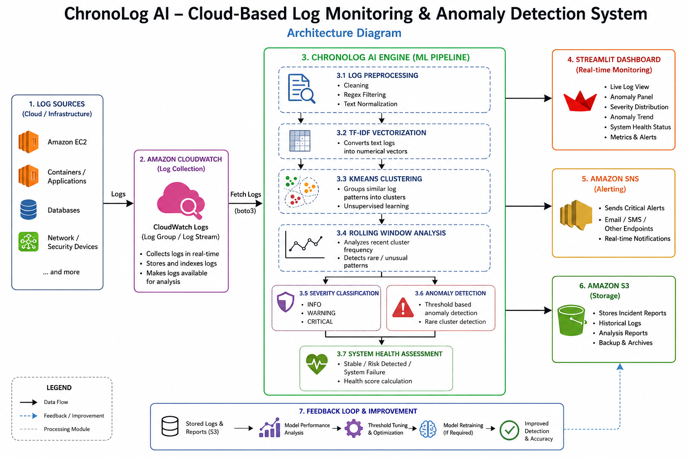
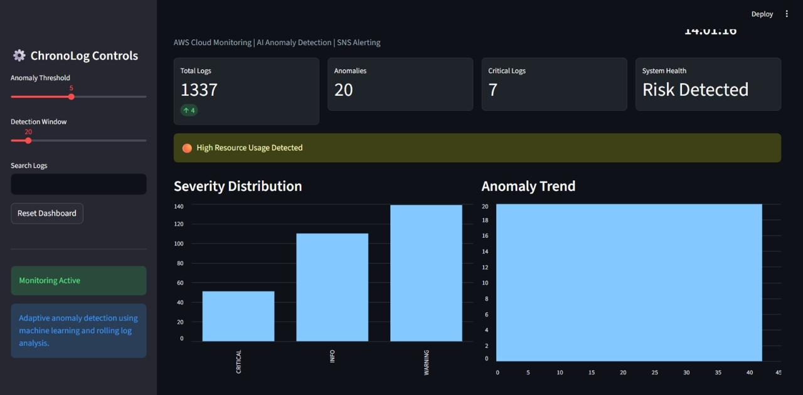
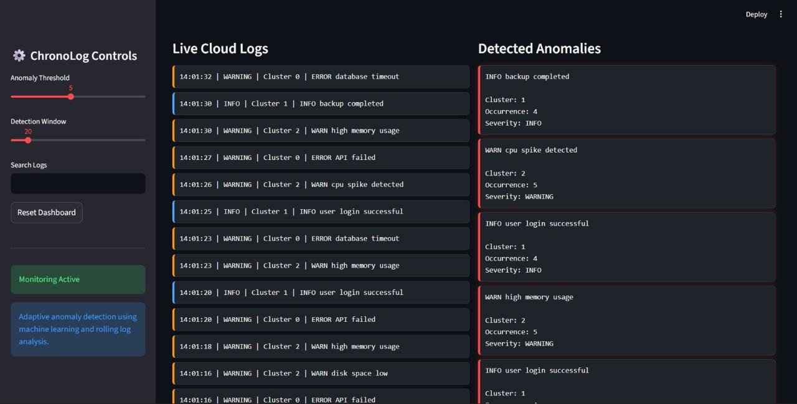

# ChronoLog-AI

## NLP Based AI-Powered Cloud-Native Log Monitoring and Anomaly Detection System

ChronoLog is a real-time cloud monitoring and anomaly detection system developed using AWS, Machine Learning, and Streamlit. The system continuously monitors logs from AWS CloudWatch, processes them using TF-IDF vectorization and K-Means clustering, and detects unusual patterns automatically.
The project aims to simplify cloud log monitoring by providing real-time analytics, anomaly alerts, and interactive visualizations through a lightweight dashboard.

# Features

- Real-time AWS CloudWatch log monitoring
- AI-based anomaly detection using Machine Learning
- TF-IDF feature extraction for log processing
- K-Means clustering for anomaly identification
- Interactive Streamlit dashboard
- Live log streaming and monitoring
- Real-time anomaly alerts
- Graphical analysis and visual insights
- Lightweight and scalable cloud-native architecture

---

# System Architecture



---

# Dashboard Preview

## Main Dashboard



---

## Anomaly Detection



---

# Tech Stack

| Technology | Purpose |
|---|---|
# ChronoLog-AI ☁️🚨

ChronoLog-AI is an AI-powered cloud log monitoring and anomaly detection system designed to analyze real-time logs generated from cloud environments. The project combines Machine Learning, AWS Cloud Services, and Real-Time Visualization to automatically identify unusual patterns in logs without relying on predefined rules.

The system continuously collects logs from AWS CloudWatch, processes them using Natural Language Processing (NLP) techniques, and applies Machine Learning algorithms to detect anomalies. Detected anomalies are displayed on an interactive Streamlit dashboard along with live log analytics and visualization graphs.

To make the system more cloud-centric and production-oriented, Amazon S3 is used for log storage and backup purposes, while Amazon SNS (Simple Notification Service) is integrated for real-time alert notifications whenever anomalies are detected.

---

## 🚀 Features

* Real-time log monitoring using AWS CloudWatch
* Automated anomaly detection using Machine Learning
* TF-IDF based NLP log vectorization
* K-Means clustering for anomaly identification
* Interactive Streamlit dashboard
* AWS S3 integration for cloud storage and backup
* AWS SNS integration for real-time anomaly alerts
* Live log streaming and analytics visualization
* Lightweight and scalable architecture
* Cloud-native implementation

---

## ☁️ AWS Services Used

### 1. Amazon CloudWatch

Used for collecting and monitoring real-time logs generated by cloud applications and services.

### 2. Amazon S3

Used for storing log files, backups, datasets, and generated outputs securely in the cloud.

### 3. Amazon SNS (Simple Notification Service)

Used for sending real-time notifications and alerts whenever anomalies are detected in the system.

### 4. AWS SDK (Boto3)

Used in Python to connect the application with AWS services like CloudWatch, S3, and SNS.

---

## 🧠 AI/ML Technologies Used

* TF-IDF Vectorization
* NLP-based Log Processing
* K-Means Clustering
* Unsupervised Anomaly Detection

---

## 📊 System Workflow

1. Logs are generated from applications or cloud systems.
2. Logs are stored and monitored using AWS CloudWatch.
3. Logs are fetched in real time using Boto3.
4. Log data is cleaned and preprocessed using NLP techniques.
5. TF-IDF converts logs into numerical vectors.
6. K-Means clustering identifies log patterns.
7. Rare or unusual logs are marked as anomalies.
8. Results are displayed on the Streamlit dashboard.
9. Anomaly alerts are sent using AWS SNS.
10. Important logs and outputs are stored in Amazon S3.

---

## 🛠️ Technologies Used

* Python
* Streamlit
* AWS CloudWatch
* AWS S3
* AWS SNS
* Scikit-learn
* Pandas
* Boto3
* Machine Learning
* NLP

---

# Machine Learning Workflow

1. Logs are fetched from AWS CloudWatch.
2. Log data is cleaned and preprocessed.
3. TF-IDF converts logs into numerical vectors.
4. K-Means clustering groups similar logs.
5. Rare clusters are identified as anomalies.
6. Results are displayed on the Streamlit dashboard.
7. Anomaly alerts are sent using AWS SNS.
8. Important logs and outputs are stored in Amazon S3.
---

# Installation

## Clone Repository

```bash
git clone https://github.com/aditya1323AI/ChronoLog-AI.git
```

## Move into Project Folder

```bash
cd ChronoLog-AI
```

## Install Dependencies

```bash
pip install -r requirements.txt
```

## Run Streamlit Application

```bash
streamlit run app.py
```

---

# Project Structure

```text
ChronoLog-AI/
│
├── app.py
├── model.pkl
├── vectorizer.pkl
├── requirements.txt
├── README.md
│
├── screenshots/
│   ├── dashboard.png
│   ├── anomaly.png
│   ├── architecture.png
│
├── dataset/
│
└── docs/
    └── project_report.pdf
```

---

# Future Scope

- Lambda integration
- CloudTrail security monitoring
- Predictive anomaly analysis
- Docker container deployment
- Multi-cloud monitoring support

---

# Applications

- Cloud Infrastructure Monitoring
- Server Log Analysis
- Security Threat Detection
- Real-Time System Monitoring
- DevOps and Observability Platforms

---

# Authors

- Aditya Malpure
- Sayali Nandapurkar

---

# License

This project is developed for educational and research purposes.
